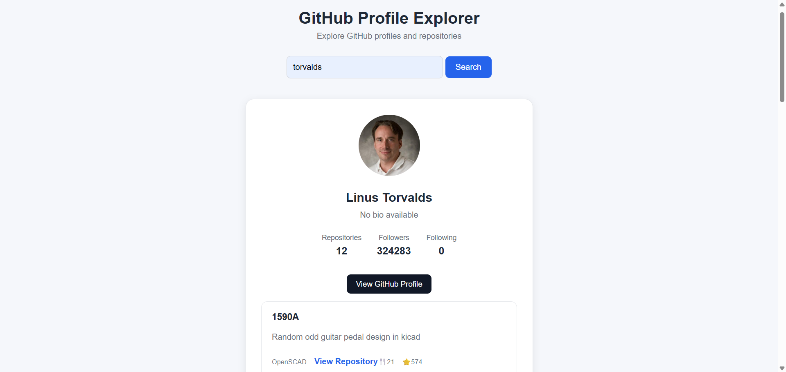
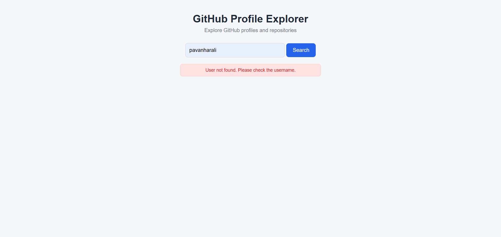
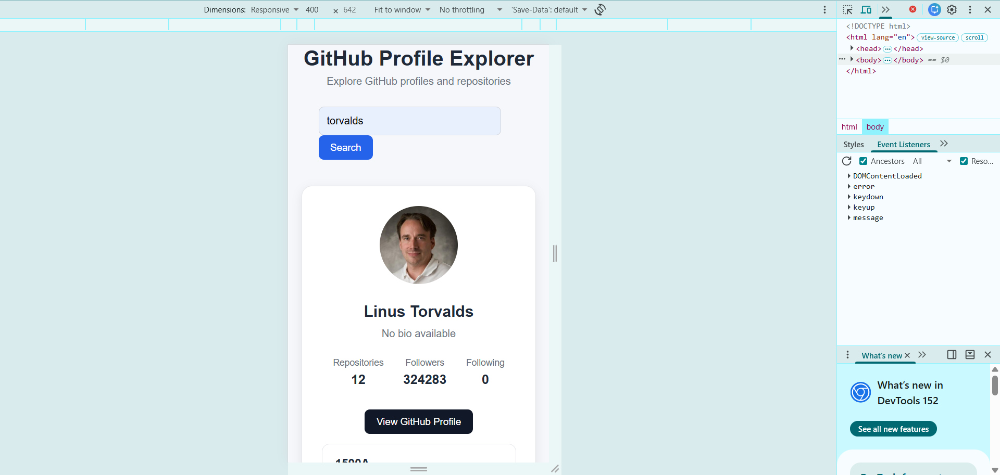

# GitHub Profile Explorer

A simple and responsive web application that allows users to search for GitHub profiles and explore their public repositories using the GitHub REST API.

## 🚀 Live Features

- 🔍 Search GitHub users by username
- 👤 Display GitHub profile information
- 🖼️ Display profile avatar
- 📝 Display profile name and bio
- 📦 Display number of public repositories
- 👥 Display followers and following
- 📚 Fetch and display public repositories
- ⭐ Display repository star counts
- 🍴 Display repository fork counts
- 💻 Display the main programming language
- 🔗 Open repositories directly on GitHub
- ⏳ Loading state while fetching data
- ❌ User-friendly error messages
- 📭 Handle users with no public repositories
- 📱 Responsive design for smaller screens

## 🛠️ Technologies Used

- HTML5
- CSS3
- JavaScript (Vanilla JS)
- GitHub REST API
- Git & GitHub

## 📂 Project Structure

github-profile-explorer/
│
├── index.html
├── style.css
├── script.js
├── README.md
│
└── screenshots/
    ├── profile-search.png
    ├── repositories.png
    ├── error-message.png
    └── mobile-view.png

## 📸 Screenshots

1. Profile Search             
2. Repository Cards           
3. Error Handling             
4. Responsive Mobile View     
